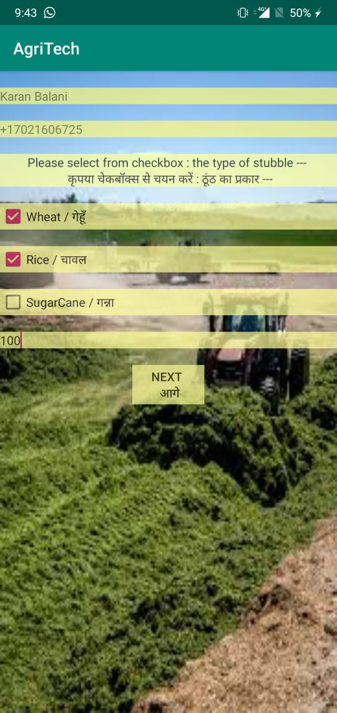

# AgriTech

Our app is for farmers , panchayats , Third party person(middle manager)

Farmers/Panchayats/Co-operatives 

Farmers and societies who want to acquire the machines can enter their district and type of machine and they will be show the machine owners and their ratings but not their contact numbers
They can only contact the third party dealers for the machines.

Third party

They can select their district and they will get contact  numbers and details of all the owners of machines.
The farmers who have called the third party person will then call the owners for placing the order.

